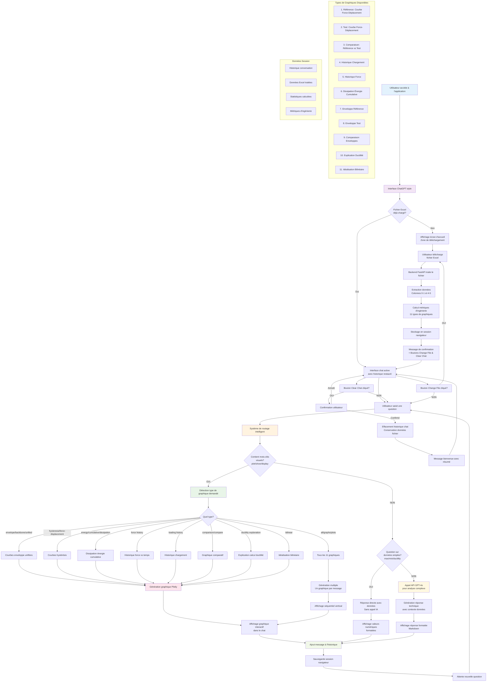

# Architecture du Chatbot d'Analyse Structurelle

## Diagramme de Flux - Interface ChatGPT avec Routage Intelligent

## Légende des Couleurs

- 🔵 **Bleu clair** - Points d'entrée utilisateur
- 🟣 **Violet clair** - Interface principale
- 🟠 **Orange clair** - Système de routage
- 🟢 **Vert clair** - Génération graphiques
- 🟡 **Jaune clair** - Traitement IA
- 🌸 **Rose clair** - Affichage résultats
- 🍃 **Vert tendre** - Gestion session

## Stratégie de Routage Intelligent

### 1. Priorisation Visuelle (PRIORITÉ 1)
- **Mots-clés détectés**: `plot`, `show`, `display`, `visualize`, `graph`, `chart`
- **Action**: Génération immédiate de graphiques Plotly interactifs
- **Résultat**: Graphiques affichés inline dans le chat

### 2. Réponses Données Directes (PRIORITÉ 2)
- **Types de questions**: 
  - "What's the max force?"
  - "Show me the ductility"
  - "What's the stiffness ratio?"
- **Action**: Calcul direct sans IA
- **Résultat**: Valeurs numériques formatées instantanément

### 3. Analyse IA Complexe (PRIORITÉ 3)
- **Modèle utilisé**: GPT-4o
- **Types de questions**:
  - Interprétations techniques
  - Recommandations ingénierie
  - Analyses comparatives approfondies
- **Action**: Traitement contextualisé avec toutes les données

## Types de Graphiques Supportés

| Type | Description | Mots-clés de Détection |
|------|-------------|------------------------|
| 1. Hystérésis Référence | Courbe Force-Déplacement cas de référence | `reference`, `hysteresis` |
| 2. Hystérésis Test | Courbe Force-Déplacement données test | `test`, `BCJS`, `specimen` |
| 3. Comparaison | Référence vs Test superposés | `comparison`, `compare`, `vs` |
| 4. Historique Chargement | Déplacement vs Temps | `loading history`, `displacement history` |
| 5. Historique Force | Force vs Temps | `force history` |
| 6. Énergie Cumulative | Dissipation d'énergie | `energy`, `cumulative`, `dissipation` |
| 7. Enveloppe Référence | Courbe enveloppe référence | `envelope`, `reference` |
| 8. Enveloppe Test | Courbe enveloppe test | `envelope`, `test` |
| 9. Comparaison Enveloppes | Enveloppes superposées | `envelope comparison` |
| 10. Explication Ductilité | Calcul ductilité annoté | `ductility explanation` |
| 11. Idéalisation Bilinéaire | Modèle bilinéaire | `bilinear`, `idealization` |

## Fonctionnalités Interface

### Boutons de Contrôle
- **Upload File**: Visible au démarrage uniquement
- **Change File**: Visible après chargement, permet de changer le fichier
- **Clear Chat**: Visible après chargement, efface l'historique mais garde les données

### Gestion Session Navigateur
- **Données conservées**: 
  - Fichier Excel traité
  - Statistiques calculées
  - Métriques d'ingénierie
  - Historique conversation
- **Restauration**: Rechargement page = interface complètement restaurée
- **Effacement**: Fermeture onglet = perte de toutes les données

## Architecture Technique

### Backend FastAPI
- **Endpoint principal**: `/chat` - Routage intelligent des requêtes
- **Endpoint upload**: `/upload` - Traitement fichiers Excel
- **Moteur graphique**: Plotly pour visualisations interactives
- **IA**: OpenAI GPT-4o pour analyses complexes

### Frontend
- **Style**: Interface ChatGPT (messages bulles, centré, défilement)
- **Graphiques**: Intégration Plotly.js inline dans les messages
- **Stockage**: Session Storage navigateur pour persistance
- **Responsive**: Adaptatif mobile/desktop

## Format de Données Excel

### Structure Attendue
- **Colonnes 0-1**: Cas de référence (U mm, F kN)
- **Colonnes 4-5**: Données test (u mm, RF kN)
- **Ligne 1**: En-têtes
- **Ligne 2+**: Données numériques
- **Cellule [0,4]**: Nom du spécimen test

### Métriques Calculées Automatiquement
- Ductilité de déplacement
- Rigidité initiale
- Dissipation d'énergie totale
- Facteur de comportement (q)
- Classification de ductilité
- Ratios comparatifs (%)

---

*Architecture générée pour l'Assistant d'Analyse Structurelle - Interface ChatGPT avec Routage Intelligent*