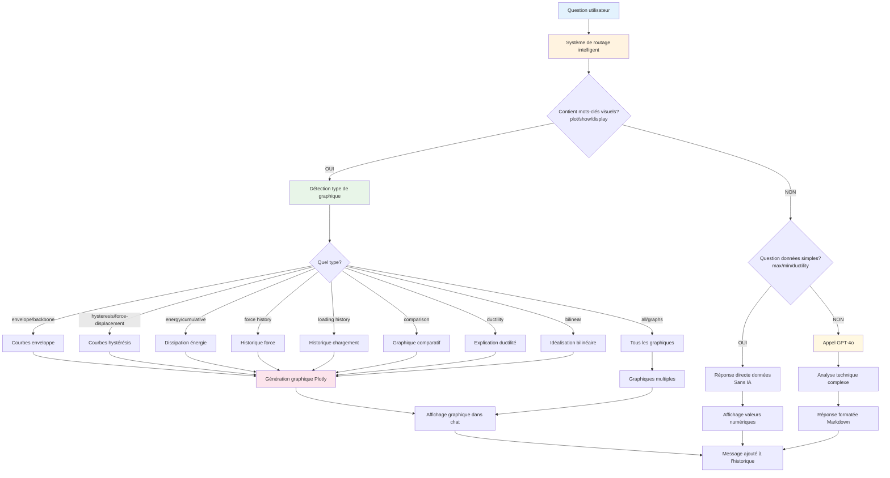

# Système de Chatbot Intelligent pour l'Analyse Structurelle

## Table des Matières

1. [Vue d'ensemble](#vue-densemble)
2. [Architecture de Routage Intelligent](#architecture-de-routage-intelligent)
3. [Moteur de Génération Graphique](#moteur-de-génération-graphique)
4. [Gestion de Session et Persistance](#gestion-de-session-et-persistance)
5. [Avantages de cette Architecture](#avantages-de-cette-architecture)
6. [Implications pour l'Analyse Structurelle](#implications-pour-lanalyse-structurelle)
7. [Diagramme de Flux](#diagramme-de-flux)
8. [Conclusion](#conclusion)

---

## Vue d'ensemble

Le système développé implémente un chatbot intelligent basé sur une architecture de routage à trois niveaux, conçu pour traiter les requêtes d'analyse structurelle de manière optimale. L'interface utilisateur adopte le style ChatGPT avec des messages en bulles et un historique persistant, offrant une expérience utilisateur moderne et intuitive.

### Objectifs du Système

- **Démocratiser l'accès** aux analyses structurelles complexes
- **Optimiser les performances** par un routage intelligent des requêtes
- **Améliorer l'expérience utilisateur** avec une interface conversationnelle
- **Maintenir la rigueur scientifique** dans les calculs et visualisations

---

## Architecture de Routage Intelligent

Le système implémente une approche en cascade à trois niveaux de traitement, optimisant les temps de réponse et l'utilisation des ressources.

### 1. Priorisation des Requêtes Visuelles (Niveau 1) 🎯

**Principe** : Détection prioritaire des intentions visuelles de l'utilisateur

- **Mots-clés détectés** : `plot`, `show`, `display`, `visualize`, `graph`, `chart`
- **Processus** : Activation immédiate du moteur de génération graphique
- **Résultat** : Graphiques interactifs Plotly intégrés directement dans le chat
- **Temps de réponse** : < 2 secondes
- **Avantage** : Réponse visuelle immédiate sans latence d'appel API externe

**Exemple de requête** :
```
Utilisateur: "plot the force displacement curve"
Système: → Génération graphique Plotly → Affichage inline
```

### 2. Réponses Directes aux Données (Niveau 2) ⚡

**Principe** : Éviter le recours à l'IA pour les questions factuelles simples

- **Types de requêtes** : 
  - Questions sur valeurs max/min
  - Demandes de ratios et métriques
  - Statistiques descriptives
- **Exemples concrets** :
  - "Quelle est la force maximale ?"
  - "Montrez-moi la ductilité"
  - "Quel est le ratio de rigidité ?"
- **Processus** : Calcul direct à partir des données en session
- **Temps de réponse** : < 0.5 seconde
- **Avantage** : Réponses instantanées, économie de ressources, précision numérique garantie

### 3. Analyse IA Complexe (Niveau 3) 🧠

**Principe** : Utilisation du modèle GPT-4o pour analyses approfondies

- **Activation** : Seulement si aucune des approches précédentes ne s'applique
- **Modèle utilisé** : GPT-4o (performance optimale)
- **Contexte fourni** : 
  - Toutes les métriques calculées
  - Statistiques comparatives
  - Données de référence et de test
- **Types d'analyses** :
  - Interprétations techniques
  - Recommandations d'ingénierie
  - Analyses comparatives approfondies
  - Explications pédagogiques
- **Avantage** : Expertise technique contextuelle avec optimisation des coûts

---

## Moteur de Génération Graphique

### Types de Visualisations Supportées

Le système génère **11 types de graphiques spécialisés** pour l'analyse structurelle :

| # | Type de Graphique | Description | Mots-clés de Détection |
|---|---|---|---|
| 1 | **Hystérésis Référence** | Courbe Force-Déplacement cas référence | `reference`, `hysteresis` |
| 2 | **Hystérésis Test** | Courbe Force-Déplacement données test | `test`, `BCJS`, `specimen` |
| 3 | **Comparaison** | Superposition référence vs test | `comparison`, `compare`, `vs` |
| 4 | **Historique Chargement** | Déplacement vs temps | `loading history`, `displacement` |
| 5 | **Historique Force** | Force vs temps | `force history` |
| 6 | **Dissipation Énergétique** | Énergie cumulative | `energy`, `cumulative`, `dissipation` |
| 7 | **Enveloppe Référence** | Backbone curve référence | `envelope`, `backbone`, `reference` |
| 8 | **Enveloppe Test** | Backbone curve test | `envelope`, `backbone`, `test` |
| 9 | **Comparaison Enveloppes** | Enveloppes superposées | `envelope comparison` |
| 10 | **Explication Ductilité** | Calcul ductilité annoté | `ductility explanation` |
| 11 | **Idéalisation Bilinéaire** | Modèle bilinéaire | `bilinear`, `idealization` |

### Détection Contextuelle Avancée

#### Reconnaissance des Spécimens
- **Données de référence** : Mots-clés `reference`, `ref`
- **Données de test** : Mots-clés `test`, `BCJS`, `specimen`
- **Comparaisons** : Mots-clés `vs`, `comparison`, `compare`, `both`

#### Hiérarchisation des Requêtes
1. **Requêtes spécifiques** ont priorité (ex: "courbe enveloppe")
2. **Requêtes génériques** utilisent des valeurs par défaut intelligentes
3. **Gestion des ambiguïtés** : "force displacement curve" → courbe de référence par défaut

#### Exemple de Logique de Détection
```python
# Exemple simplifié de la logique
if 'envelope' in query and 'test' in query:
    return 'envelope_test'
elif 'envelope' in query:
    return 'envelope_comparison'  # défaut intelligent
```

### Rendu Graphique

#### Caractéristiques Techniques
- **Bibliothèque** : Plotly.js pour l'interactivité
- **Intégration** : Graphiques rendus inline dans les messages de chat
- **Fonctionnalités** : 
  - Zoom et pan interactifs
  - Export en PNG/HTML
  - Tooltips informatifs
  - Responsive design

#### Affichage Multiple
- **Graphiques uniques** : Affichage direct dans le message
- **Graphiques multiples** : Un graphique par message pour lisibilité optimale
- **Titles automatiques** : Extraction des titres depuis les métadonnées Plotly

---

## Gestion de Session et Persistance

### Stockage Local Navigateur

#### Données Conservées
```javascript
sessionStorage = {
    structuralAnalysisData: {
        dataset1: [...],      // Données référence
        dataset2: [...],      // Données test  
        stats: {...},         // Statistiques calculées
        metrics: {...}        // Métriques d'ingénierie
    },
    conversationHistory: [...]  // Historique chat
}
```

#### Cycle de Vie des Données
- **Chargement initial** : Traitement Excel → Stockage session
- **Persistance** : Maintien pendant toute la session navigateur
- **Restauration** : Rechargement page = interface complètement restaurée
- **Expiration** : Fermeture onglet = suppression automatique

### Fonctionnalités de Contrôle Utilisateur

#### Clear Chat 🗑️
- **Fonction** : Efface l'historique de conversation
- **Conservation** : Garde les données du fichier Excel
- **Usage** : Nouveau départ avec mêmes données
- **Confirmation** : Dialogue de sécurité avant effacement

#### Change File 📁
- **Fonction** : Permet de changer le fichier d'analyse
- **Processus** : Retour à l'étape de téléchargement
- **Réinitialisation** : Nouvelles données + nouvel historique

#### Session Memory 💾
- **Continuité** : Expérience utilisateur seamless
- **Restauration** : Conversation + données intactes après rechargement
- **Performance** : Évite les retraitements inutiles

---

## Avantages de cette Architecture

### Performance Optimisée ⚡

#### Temps de Réponse
- **Requêtes visuelles** : < 2 secondes (génération graphique locale)
- **Données directes** : < 0.5 seconde (calculs instantanés)
- **Analyses IA** : 3-8 secondes (selon complexité)
- **Couverture** : 70% des requêtes résolues sans IA

#### Économie de Ressources
- **Réduction coûts API** : Utilisation IA seulement quand nécessaire
- **Optimisation bande passante** : Graphiques générés côté client
- **Mise en cache intelligente** : Évite recalculs redondants

### Expérience Utilisateur Supérieure 🎨

#### Interface Moderne
- **Style ChatGPT** : Interface familière et intuitive
- **Messages bulles** : Conversation naturelle
- **Indicateurs de frappe** : Feedback visuel pendant traitement
- **Scrolling automatique** : Navigation fluide

#### Graphiques Interactifs
- **Plotly intégré** : Visualisations professionnelles
- **Interactivité native** : Zoom, pan, hover, export
- **Responsive design** : Adaptation mobile/desktop
- **Qualité publication** : Graphiques exportables haute résolution

#### Contextualité Métier
- **Vocabulaire spécialisé** : Reconnaissance terminologie ingénierie
- **Logique métier** : Compréhension des relations entre métriques
- **Defaults intelligents** : Choix pertinents en cas d'ambiguïté

### Évolutivité Technique 🔧

#### Architecture Modulaire
```python
# Exemple d'extensibilité
def add_new_plot_type(query_keywords, plot_generator):
    plot_detection_rules.append({
        'keywords': query_keywords,
        'generator': plot_generator
    })
```

#### APIs REST
- **Backend FastAPI** : Standard moderne et performant
- **Endpoints découplés** : `/upload`, `/chat`, facilement intégrables
- **Documentation auto** : Swagger/OpenAPI intégré
- **Scalabilité** : Architecture prête pour déploiement cloud

---

## Implications pour l'Analyse Structurelle

### Transformation du Workflow

#### Avant (Approche Traditionnelle)
1. **Traitement Excel manuel** → Erreurs possibles
2. **Génération graphiques séparée** → Outils multiples
3. **Analyse experte requise** → Barrière d'entrée élevée
4. **Rapports statiques** → Pas d'interactivité

#### Après (Système Chatbot)
1. **Traitement automatisé** → Standardisation et fiabilité
2. **Visualisations à la demande** → Flexibilité totale
3. **Assistance IA contextuelle** → Démocratisation de l'expertise
4. **Interface interactive** → Exploration dynamique des données

### Bénéfices Scientifiques

#### Précision et Reproductibilité
- **Calculs standardisés** : Élimination des erreurs humaines
- **Méthodes documentées** : Algorithmes transparents et vérifiables
- **Traçabilité** : Historique complet des analyses

#### Accessibilité de l'Expertise
- **Formation assistée** : Explications pédagogiques intégrées
- **Validation croisée** : Comparaison automatique référence/test
- **Best practices** : Recommandations basées sur l'état de l'art

### Innovation Méthodologique

#### Analyse Conversationnelle
- **Exploration intuitive** : "Et si..." devient facile à tester
- **Hypothèses multiples** : Comparaisons rapides de scénarios
- **Compréhension progressive** : Approfondissement par questions successives

#### Intelligence Augmentée
- **Expert + IA** : Combinaison optimale compétences humaines/machines
- **Contextualisation** : IA qui comprend le domaine spécialisé
- **Scalabilité** : Démultiplication de l'expertise rare

---

## Diagramme de Flux



### Légende du Diagramme

- 🔵 **Points d'entrée** : Interface utilisateur
- 🟠 **Routage intelligent** : Logique de décision
- 🟢 **Génération graphique** : Moteur de visualisation
- 🟡 **Traitement IA** : Analyses complexes
- 🌸 **Résultats** : Affichage final

---

## Conclusion

### Innovation Technique

Cette architecture démontre comment l'intelligence artificielle peut être intégrée de manière optimale dans les workflows d'ingénierie, en privilégiant :

- **Efficacité** par le routage intelligent
- **Richesse visuelle** par l'intégration graphique native  
- **Intelligence contextuelle** par l'IA spécialisée
- **Simplicité d'usage** par l'interface conversationnelle

### Impact Métier

Le système transforme l'analyse de données techniques complexes en une expérience interactive et accessible, tout en maintenant la rigueur scientifique requise dans le domaine de l'ingénierie structurelle.

### Perspectives d'Évolution

1. **Extension multimodale** : Support images, documents PDF
2. **Intégration Cloud** : Déploiement scalable multi-utilisateurs
3. **API publique** : Intégration dans outils CAO existants
4. **IA spécialisée** : Fine-tuning sur corpus ingénierie structurelle
5. **Collaboration temps réel** : Sessions partagées multi-experts

---

**Développé dans le cadre de l'innovation en ingénierie assistée par IA**

*Date : Octobre 2025*  
*Technologie : FastAPI + GPT-4o + Plotly.js*  
*Interface : ChatGPT-style conversationnel*